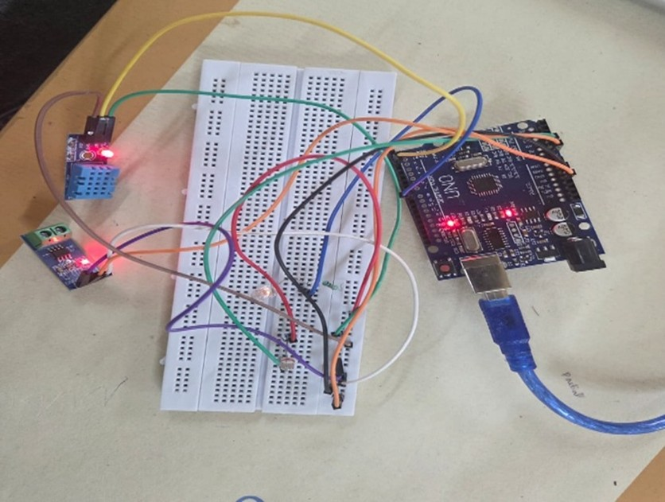
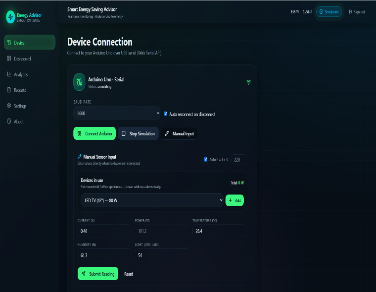
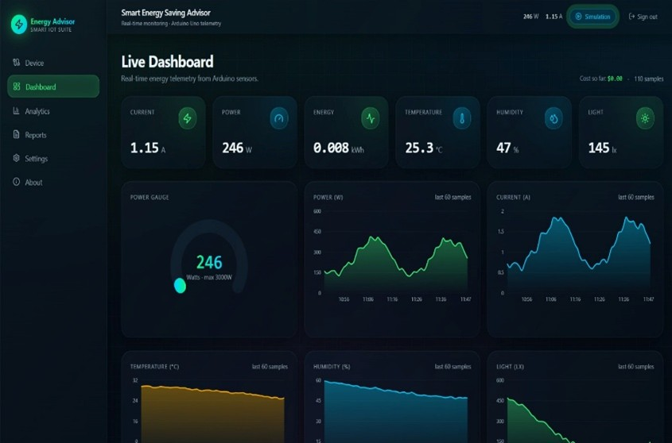
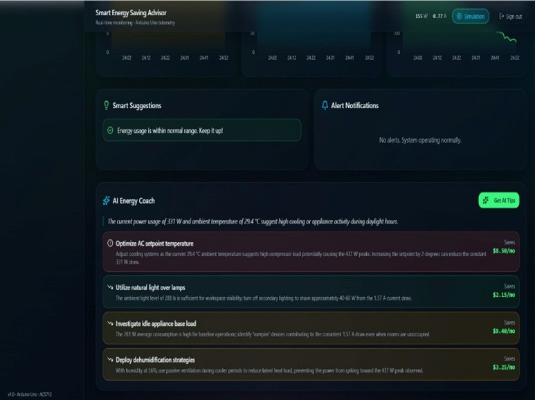
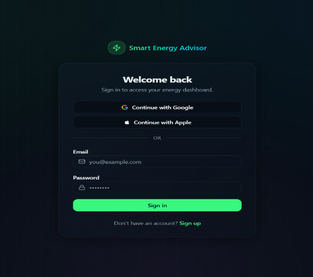

# Smart Energy Advisor

## Project Overview
Smart Energy Advisor is an IoT-based energy monitoring system that collects real-time data from sensors and displays it on a web dashboard. The system analyzes power consumption and provides energy-saving recommendations.

## Features
- Real-time Current Monitoring
- Temperature Monitoring
- Humidity Monitoring
- Light Intensity Detection
- Power Consumption Analysis
- Energy Usage Analytics
- AI-Based Energy Saving Suggestions

## Hardware Components
- Arduino UNO
- DHT11 Sensor
- ACS712 Current Sensor
- LDR Sensor
- LED
- Breadboard
- Jumper Wires

## Technologies Used
- Arduino IDE
- C++
- HTML
- CSS
- JavaScript
- GitHub
- Lovable AI

## Live Website
https://smartenergyadvisor.lovable.app

## Project Images

### Hardware Setup

### Device Connection

### Dashboard

### AI Suggestions

### Login Page

## Project Structure

Smart-Energy-Advisor
├── Arduino_Code
├── Images
├── Smart_Energy_Advisor_Report.pdf
└── README.md

## Developed By
Manya Jain
